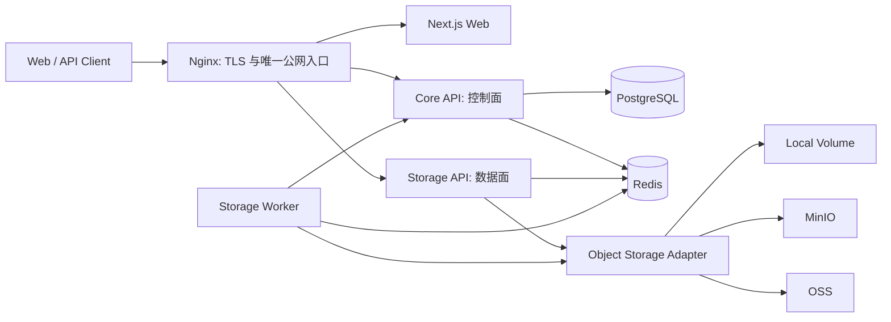
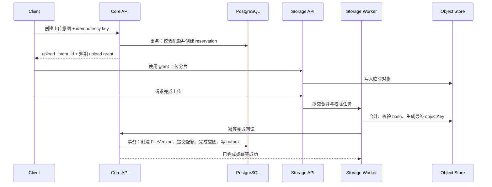
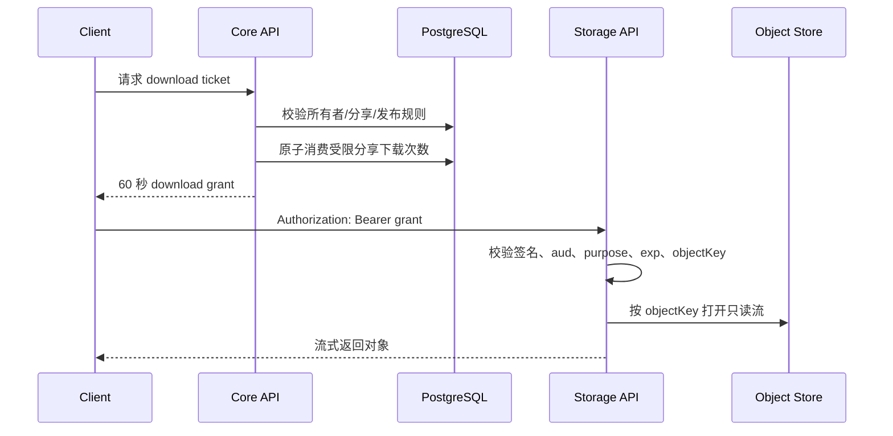

# MyWebDrive Core API + Storage Data Plane 架构设计

- 状态：待书面确认
- 日期：2026-07-10
- 决策：采用“模块化 Core API + 独立 Storage Data Plane”作为目标架构
- 适用范围：后端、数据模型、认证授权、上传下载链路、部署与发布系统

## 1. 背景与问题

MyWebDrive 当前把认证、用户、元数据、存储、分享和网关拆成多个 Node.js 服务。业务规模尚未形成必须独立扩缩容的六个边界，但系统已经承担了分布式事务、跨服务鉴权、配置漂移、迁移顺序和多套部署入口的复杂度。

当前审查确认了以下阻塞性风险：

1. 存储服务存在无需授权、直接接受文件标识的下载入口；本地存储模式下，编码后的路径片段可以逃逸存储根目录。该入口还可绕过分享密码、过期时间和下载次数等业务约束。
2. 公共 Git 历史包含环境文件和非空 SQLite 数据库。历史中出现过的秘密必须按已经泄露处理，数据库中的用户、邀请、文件元数据和上传会话不得继续作为可信生产数据分发。
3. 旧部署编排把 PostgreSQL Prisma schema 与 `file:` SQLite URL 混用，环境变量名称也不一致，能够在启动或迁移阶段直接失败。
4. 部署脚本使用带 `--delete` 的代码同步，而运行期对象数据位于代码树附近；回滚或重新部署可能删除上传文件，既有备份路径又没有覆盖这部分数据。
5. CI 的工作区过滤器被 shell 展开，实际命令没有执行目标包却返回成功；日志中还出现 Prisma 校验失败、测试工具缺失、lint/typecheck 未真实执行等情况。因此绿色状态不能证明制品可用。
6. 用户服务公开了可由普通登录用户调用的存储用量调整接口，负数可将用量归零；元数据服务在缺少用户服务地址时又会放行配额检查。
7. 上传完成链路跨越文件写入、配额调整和版本创建，但没有统一事务或稳定幂等键；重试可能产生重复版本，部分失败可能留下孤儿对象或不一致配额。
8. 邀请码消费存在并发竞争；健康检查只报告进程存活，无法证明数据库、Redis 或对象存储可用。
9. 多套 compose、同步脚本和文档并存，生产入口不唯一；数据库迁移、镜像版本、线上版本识别和可逆回滚缺少统一契约。
10. 前端仍存在假成功和假数据回退，并把认证材料放入 localStorage 或 URL；请求 URL 日志可能记录令牌。

这些不是独立的“小 bug”。它们共同说明当前服务边界没有把复杂性封装起来，反而把一致性和安全责任分散到了多个浅接口中。

## 2. 目标

本设计追求以下结果：

- 让控制面业务在一个事务边界内完成，消除不必要的跨服务一致性问题。
- 保留对象传输的独立进程边界，使大文件流式传输、背压和后台合并不会拖垮控制面。
- 所有文件访问都经过统一的 Access Grant 规则，不再暴露原始文件标识作为下载凭证。
- 把配额从可任意修改的计数器改成可审计、可预留、可幂等提交的账本。
- 建立唯一的生产部署入口、迁移入口和版本识别方式。
- 让 CI、readiness 和发布验证真正失败即阻塞，而不是“记录错误后继续成功”。
- 在不大爆炸重写的前提下，逐条路由迁移并保持现有 `/api/v1/*` 外部契约。

## 3. 非目标

本轮不引入以下能力：

- Kubernetes、服务网格或多区域部署。
- Kafka、RabbitMQ 等独立消息基础设施。
- 新的前端视觉重构或新业务功能。
- 为未来假设场景创建大量接口或插件层。
- 一次性替换全部数据和路由的“大爆炸”上线。
- 完整的客户端端到端加密体系；如需该能力，应单独设计密钥和恢复模型。

## 4. 方案比较与决策

### 方案 A：继续修补六个微服务

优点是文件改动较小，现有目录能够保留。缺点是每个业务动作仍然需要跨进程调用，必须继续承担分布式事务、内部鉴权、超时重试、服务发现和多数据库迁移的成本。它可以作为止血阶段的载体，但不适合作为目标架构。

### 方案 B：模块化 Core API + Storage Data Plane

Core API 合并认证、用户、文件元数据、分享、发布、配额、上传编排和管理能力；Storage 保持独立，专注对象读写、流式传输和任务执行。该方案把需要强一致性的业务放回同一事务边界，同时保留真正需要独立资源治理的数据面。

这是本设计选择的方案。

### 方案 C：全部合并为单进程单体

部署最简单，但大文件上传、下载、哈希和合并会与认证、分享和管理请求争用事件循环、连接与内存。任何流式处理缺陷都可能扩大为全站故障，因此不采用。

## 5. 目标架构

### 5.1 进程边界

生产环境只保留以下应用进程：

- `web`：Next.js 页面和静态资源。
- `core-api`：所有控制面 HTTP API 和领域规则。
- `storage-api`：分片上传、对象读取、下载流、限速和票据验证。
- `storage-worker`：分片合并、哈希校验、完成回调、孤儿对象清理和对账任务。它与 storage-api 使用同一代码库和镜像，但以不同命令启动。

Nginx 是唯一公网入口。目标态不再保留一层独立 Node API Gateway；路由、TLS、静态缓存和基础限流由 Nginx 完成，业务鉴权由 Core API 或 Storage 的票据验证完成。

### 5.2 Core API 的深模块

Core API 内部使用模块边界，而不是继续把模块伪装成远程服务：

- `Identity Module`：账号、凭证、邀请、访问令牌、刷新会话和撤销。
- `File Metadata Module`：文件、版本、目录关系、标签和展示元数据。
- `Access Grant Module`：所有者、分享密码、过期时间、下载次数、发布状态和短期票据签发。
- `Quota Ledger Module`：配额预留、提交、释放、审计和余额计算。
- `Upload Orchestrator Module`：上传意图、状态机、幂等完成和超时恢复。
- `Catalog/Admin Module`：公开目录、发布审核和管理操作。
- `Outbox Module`：事务内记录待处理事件，由 worker 可靠消费。

这些模块通过进程内调用协作。每个模块拥有其表和规则，但可在同一个 PostgreSQL 事务中完成跨模块业务动作。模块深度来自封装完整的不变量，而不是目录数量。

### 5.3 必要的可变接口

当前唯一明确需要多实现的基础设施 seam 是 Storage 代码库中的 `ObjectStorage`：

- Local Volume Adapter：本地或单机部署。
- MinIO Adapter：自托管 S3 兼容对象存储。
- OSS Adapter：云生产环境。

接口只覆盖实际需要的能力：写入分片、完成对象、打开只读流、获取对象状态和删除对象。业务模块只持有稳定的 `objectKey`，不拼接磁盘路径或供应商 URL。

Local Adapter 必须使用 `path.resolve` 后验证结果仍位于配置根目录内，并拒绝 `..`、路径分隔符、非法编码和非预期标识格式。即使上层票据校验失效，适配器自身也不能越界读取。

除对象存储外，不为只有一个实现的领域模块预先创建抽象层。

## 6. 信任边界与认证模型

### 6.1 用户会话

- 访问令牌有效期建议为 15 分钟，只保存在前端内存中。
- 刷新令牌放入 `HttpOnly`、`Secure`、明确 `SameSite` 的 Cookie，不进入 localStorage。
- 刷新令牌具有 `jti`，每次刷新轮换，并记录会话族；检测到旧令牌重用时撤销整个会话族。
- 令牌验证固定允许的算法，并验证 `type=access`、`issuer`、`audience`、过期时间和签名。
- SSE 改用带 Authorization Header 的 fetch 流，不把访问令牌放入查询字符串。

### 6.2 Core 与 Storage 的服务身份

用户访问令牌不能直接作为 Storage 的内部权限。Core 使用独立密钥签发短期 grant：

- `aud` 固定为 `storage-api`。
- `purpose` 为 `upload` 或 `download`。
- 包含不可猜测的 `objectKey`、允许的操作、过期时间和一次性标识；Storage 使用 Redis 原子登记已消费标识，拒绝重放。
- 下载 grant 可包含文件名、Content-Type 和 Content-Disposition，但不能包含可用于磁盘路径拼接的用户输入。
- 上传完成回调使用独立服务身份或双向受限的内部签名，不能复用用户 JWT_SECRET。

日志中必须默认删除 Authorization、Cookie、grant、refresh token 和完整查询字符串。需要关联请求时使用 request ID、用户 ID 哈希或 grant 的不可逆指纹。

## 7. 数据模型与所有权

使用一个 PostgreSQL 数据库和一条有序迁移历史。模块可以拥有不同 schema 或表前缀，但生产部署只运行一个迁移入口，并允许一个事务访问多个模块表。

核心表如下：

| 模块 | 表 | 责任 |
| --- | --- | --- |
| Identity | `users`, `credentials` | 用户与登录凭证 |
| Identity | `refresh_sessions` | 刷新令牌族、轮换和撤销 |
| File Metadata | `files`, `file_versions` | 逻辑文件与不可变版本 |
| Access Grant | `shares`, `publications` | 分享约束与公开发布状态 |
| Upload Orchestrator | `upload_intents` | 上传状态机和幂等键 |
| Quota Ledger | `quota_reservations`, `quota_ledger` | 预留、提交、释放和审计记录 |
| Outbox | `outbox_events` | 与业务事务一起提交的后台事件 |

对象字节不进入 PostgreSQL。数据库只保存稳定 `objectKey`、大小、哈希、状态和来源。

数据库约束负责最后一道一致性保护：

- `upload_intents.idempotency_key` 在用户范围内唯一。
- 每个成功上传意图只能生成一个文件版本。
- 配额账本项具有唯一业务引用，重试不能重复记账。
- 分享下载次数通过条件更新原子消费，不能先读后写。
- 邀请码消费和用户创建位于同一事务中，并通过行锁或条件更新避免并发复用。

## 8. 关键业务流

### 8.1 上传

规则：

1. Core 在创建上传意图时预留配额，而不是上传完成后再检查。
2. Storage 不创建业务文件记录，也不直接调整用户配额。
3. Worker 完成回调以 `upload_intent_id` 和幂等键为依据。重复回调返回同一个结果。
4. Core 的最终事务同时创建文件版本、把 reservation 转为 committed、标记意图完成并写入 outbox。
5. 超时或明确取消时释放 reservation。后台对账负责清理过期临时对象和标记无主最终对象。
6. 数据库提交失败时不得立即丢弃最终对象；先保留为可对账状态，等待幂等重试或清理窗口。

### 8.2 私有下载、分享下载和公开目录

三类入口统一经过 Access Grant Module：

- 私有文件：验证当前用户对文件或版本的权限。
- 分享文件：验证密码、过期时间、禁用状态和剩余下载次数。
- 公开目录：验证 publication 状态；只在明确选择 CDN 发布模式时返回外部公开 URL，否则同样签发短期票据。

Storage 不接受裸 `fileId` 作为授权依据。默认下载通过 Authorization Header 携带 grant；如果必须支持浏览器直接导航，只能使用短期、一次性、不可推导 objectKey 的 opaque token，并在代理和应用日志中强制脱敏。

## 9. 一致性、错误处理与恢复

### 9.1 状态机

上传意图只允许以下主路径：

`created -> uploading -> finalizing -> completed`

终止状态为 `aborted` 或 `expired`。状态更新使用条件更新，跳过非法转换。调用者重试时得到当前稳定状态，而不是重复执行副作用。

### 9.2 Outbox 与后台任务

业务事务内只写 `outbox_events`，不在事务提交前依赖外部网络调用。Worker 使用 `event_id` 幂等消费；失败保留重试次数和下次执行时间。当前规模不需要引入消息中间件，PostgreSQL outbox 与 Redis 队列足够。

### 9.3 对账

定时任务至少覆盖：

- 过期 reservation 与 upload intent。
- 已存在对象但没有 completed intent 的孤儿对象。
- 已 completed 但对象不存在或大小/hash 不一致的损坏记录。
- quota ledger 与有效文件版本总量的差异。
- outbox 长时间未消费事件。

对账先生成可审计报告，再执行具有明确保留期的自动清理。生产对象删除必须软删除或延迟删除，避免瞬时故障造成不可逆损失。

## 10. API 兼容策略

迁移期间继续保持 `/api/v1/*` 公共前缀和前端依赖的主要响应结构。Nginx 按路由或 feature flag 把请求切到 Core API：

- 先迁移只读和低风险路由。
- 再迁移认证、分享和配额写操作。
- 最后迁移上传完成和下载票据链路。

旧服务只作为短期兼容实现，不再新增业务。对于错误的旧契约，例如公开裸文件下载和用户可调用的配额调整，不保持兼容，直接关闭并提供安全替代接口。

Core API 对外提供的关键新能力为：

- 创建、查询和取消上传意图。
- 为上传意图签发短期 upload grant。
- 为私有文件、分享或 publication 签发短期 download grant。
- 查询当前用户的 quota balance 和 reservation，不提供任意 delta 调整接口。

## 11. 部署与发布

### 11.1 唯一生产入口

仓库只保留一个权威生产编排文件 `compose.production.yml`。其他历史编排移入 archive 或明确标记不可用于生产。

所有应用使用不可变镜像，标签至少包含 Git commit SHA，并在部署记录中保存镜像 digest。服务器不再通过 rsync 同步运行代码，也不在代码目录保存对象数据。

目录和卷边界：

- 应用代码与镜像文件系统只读。
- 对象数据位于独立的 `/data/storage` 或命名 volume。
- PostgreSQL、Redis 和对象存储各自使用独立持久卷。
- 备份任务显式覆盖数据库和对象数据，并定期执行恢复演练。

### 11.2 发布顺序

1. 拉取按 SHA/digest 固定的镜像。
2. 验证 compose 配置和所需环境变量。
3. 备份或确认最近可恢复快照。
4. 运行唯一的 `prisma migrate deploy` 迁移任务；失败立即停止发布。
5. 启动应用并等待 readiness。
6. 执行认证、上传、下载、分享约束和版本接口的冒烟测试。
7. 切换流量并记录部署 SHA、digest、迁移版本和操作者。

数据库变更使用 expand/contract：先添加兼容结构，再发布双读或双写代码，完成回填和验证后，下一次发布才删除旧结构。

### 11.3 健康与版本

- `/live` 只表示进程和事件循环可响应。
- `/ready` 检查 PostgreSQL、Redis、对象存储以及当前进程必需的内部能力；任一关键依赖不可用时返回非 2xx。
- `/version` 返回 commit SHA、build ID、镜像 digest（若可用）、迁移版本和启动时间。
- Nginx 对外暴露上述明确路径，不用前端 404 代替 readiness。

## 12. CI 质量门

CI 中每个检查必须有真实目标且失败即终止：

1. 锁文件一致安装。
2. 精确、加引号的 workspace filters，或者直接使用明确包名。
3. Prisma schema validate 与从空数据库执行完整迁移。
4. TypeScript build 和 typecheck。
5. lint。
6. 单元测试与关键并发测试。
7. Docker image build。
8. `docker compose config`。
9. 在全新基础设施上的最小端到端测试。

禁止在质量门使用 `|| true`，禁止把“没有匹配包”当作成功。CI 还必须加入一条自检：故意制造失败的测试分支能够让 job 变红，防止再次出现假绿色。

重点自动化场景包括：

- URL 编码、双重编码、绝对路径和 `..` 的目录穿越测试。
- 无 grant、过期 grant、错误 audience、错误 purpose 和篡改 grant 的拒绝测试。
- 并发上传不能超过 quota reservation。
- 完成回调重复 10 次仍只创建一个 FileVersion 和一条 committed ledger。
- 并发消费最后一次分享下载额度只能成功一次。
- 邀请码并发注册只能成功一次。
- PostgreSQL、Redis 或对象存储断开时 readiness 变为失败。
- 从空卷启动、迁移、上传、下载和按镜像 digest 回滚的演练。

## 13. 迁移阶段

### Phase 0：立即止血（0–24 小时）

- 冻结生产发布，备份 PostgreSQL、对象存储和当前环境配置。
- 将代码仓库设为私有或确认公开范围；轮换历史中出现过的全部秘密、访问密钥和 JWT 密钥。
- 从当前可访问分支移除环境文件和数据库，后续单独执行历史清理；在轮换完成前不依赖“删文件”作为安全措施。
- 关闭裸文件下载和目录穿越入口，所有下载暂时回到经过授权的服务路径。
- 删除普通用户可调用的 quota adjust 能力，并让配额依赖缺失时 fail closed。
- 以最新主线修复为基线整理分支，避免在明显落后的部署分支继续叠加变更。

### Phase 1：建立可信发布系统（1–3 天）

- 固化唯一 compose、不可变镜像、独立数据卷和唯一迁移任务。
- 修复 CI filters，确保 build、lint、typecheck、test 和迁移真实执行。
- 实现 `/live`、`/ready`、`/version` 和部署后冒烟检查。
- 验证备份覆盖对象数据，并完成一次隔离环境恢复。

### Phase 2：建立三个关键深模块（约 1 周）

- 在现有服务可兼容的路径上先实现 Access Grant Module。
- 实现 Quota Ledger 与 reservation，替换跨服务任意 delta。
- 实现 Upload Orchestrator、幂等完成和 outbox。
- Storage 改为只接受短期 grant 和稳定 objectKey。

### Phase 3：逐路由合并 Core API（1–2 周）

- 按 Identity、File Metadata、Sharing/Publication、Catalog/Admin 顺序迁移。
- 通过 Nginx 路由和 feature flag 灰度；对安全的只读请求可做影子比对。
- 保持前端所需响应契约，记录新旧实现的差异。
- 每完成一个模块，就停止旧服务写入并迁移其数据所有权。

### Phase 4：清理与恢复演练（2–3 天）

- 删除旧 gateway 和拆分服务的生产入口。
- 归档互相冲突的 compose、部署脚本和文档。
- 删除旧数据库和内部 service token 前，确认无流量、无回滚依赖。
- 完成一次数据库恢复、对象恢复、镜像回滚和 orphan reconciliation 演练。

## 14. 灰度与回滚

- 每个阶段开始前创建数据库和对象存储快照。
- 新下载票据、新上传编排和新 Core 路由分别由独立 feature flag 控制。
- 只读接口可以影子请求比对；具有计数、消费或写入副作用的接口不能双执行。
- 数据迁移遵循 expand/contract，旧字段至少保留一个稳定发布周期。
- 应用回滚使用已验证的镜像 digest，不回滚服务器 Git 工作树。
- 回滚应用不能删除新对象；版本不兼容时停止写入并进入维护模式，而不是强行启动旧代码。

## 15. 可观测性

每个请求传播 request ID；上传额外传播 upload intent ID；后台事件传播 event ID。指标至少包括：

- Core API 和 Storage 的请求量、错误率和延迟。
- 活跃上传、完成延迟、失败原因和 orphan 数。
- quota reservation 数量、超时释放和对账差异。
- grant 签发量、校验失败原因和重放拒绝。
- outbox backlog、重试次数和最老事件年龄。
- 数据库连接池、Redis 与对象存储可用性。

告警必须指向可行动的失败：readiness 连续失败、迁移失败、对象丢失、配额对账不一致、outbox backlog 超阈值和备份恢复验证失败。

## 16. 验收标准

目标架构完成时必须同时满足：

- 没有任何 Storage 文件读取入口能在缺少有效 grant 或服务身份时返回对象。
- 所有目录穿越变体均返回 4xx，且无法读到存储根目录之外的文件。
- 普通用户不能直接调整配额；并发上传不能超过预留额度。
- 同一上传完成请求任意重试只产生一个 FileVersion 和一次配额提交。
- 分享密码、过期时间和下载次数在签发 ticket 前统一校验，最后一次额度并发消费只有一个成功。
- 新环境可以仅凭 commit SHA/digest、配置和备份完成迁移与启动。
- CI 对真实 build、lint、typecheck、test、迁移、镜像和 compose 失败均显示红色。
- PostgreSQL、Redis 或对象存储不可用时 readiness 返回失败。
- 回滚镜像不会修改或删除对象数据。
- `/version` 能把线上实例关联到唯一 commit、镜像和迁移版本。
- refresh token 不进入 JavaScript 可读存储，访问令牌不进入 URL 或请求日志。
- 前端不再用假成功、假项目或假下载掩盖后端错误。

## 17. 已知风险与约束

- 当前分支与主线存在较大差异。实施前必须先选择并验证基线，避免把已在主线修复的问题重新引入。
- 历史数据库可能包含生产或测试混合数据。迁移前需要数据分类、清洗和唯一性审计，不能直接合并所有 SQLite 内容。
- 令牌密钥轮换可能使现有会话全部失效，应提前准备强制重新登录提示。
- 从裸 fileId 切换到 download grant 会改变前端下载方式和缓存行为，需要同版本发布兼容客户端。
- Core 合并后不是“没有边界”；必须以模块所有权、数据库约束和测试维持边界，禁止重新形成无组织的共享工具层。
- Storage Worker 与 Core 的完成回调是跨进程 seam，必须保持幂等、可重试和可对账，不能假设网络恰好一次交付。

## 18. 决策摘要

MyWebDrive 的控制面复杂度主要来自错误的进程切分，而数据面确实具有独立的资源和故障特征。因此目标不是继续扩大微服务数量，也不是把所有能力塞回单进程，而是：

> 用一个模块化 Core API 封装业务不变量和事务，用一个独立 Storage Data Plane 承担对象流与后台任务；所有跨边界操作都通过短期 grant、幂等状态机和可对账记录完成。

书面设计确认后，下一步是生成逐文件实施计划，明确每个阶段的测试、兼容路由、数据迁移、上线检查和回滚点。
