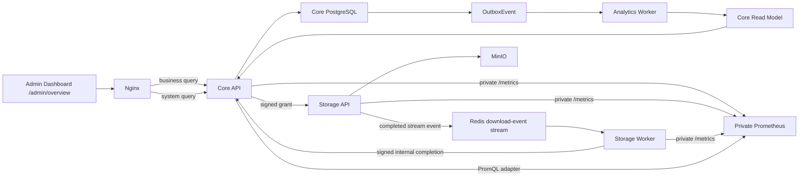

# Admin Dashboard Analytics Rebuild Design

- **Status:** Approved for implementation
- **Date:** 2026-07-12
- **Scope:** Rebuild the Admin Dashboard data subsystem around a Core Read Model, an Analytics Worker, and private Prometheus telemetry.

## 1. Decision

The existing `/api/v1/admin/overview` aggregation is not migrated or adapted. It is replaced by a new Dashboard data subsystem with two independent domains:

1. **Business Analytics** comes from Core-owned facts and a durable PostgreSQL read model.
2. **System Health** comes from private Prometheus queries over Core, Storage API, and Storage Worker metrics.

The existing `/admin/overview` page remains the administrator entry point, but its data client and page state are rewritten. The old Node API Gateway and the retired Auth, User, Metadata, Sharing, and Storage statistics databases never return to the production request path.

This is a full rewrite of the Dashboard data subsystem, not a rewrite of the working Core transaction model or the Storage byte-transfer model. Existing identity, quota, upload, file, sharing, publication, and grant invariants remain authoritative.

## 2. Problem Statement

Production Nginx sends `/api/v1/*` to Core, while the current frontend still calls `GET /api/v1/admin/overview`. Core has no matching route, so the authenticated page receives a 404 and collapses every card and chart into one page-level failure.

The retired Gateway implementation cannot be restored as the new design because it:

- depends on services that are no longer in the production control plane;
- treats process-lifetime counters as range-scoped values;
- uses newly created users as a proxy for active users;
- stores unique visitors in process memory;
- derives latency percentiles from scraped cumulative buckets in application code;
- cannot distinguish ticket issuance from a completed object download.

The rebuild must provide traceable metric definitions, explicit freshness and coverage, idempotent aggregation, and partial failure isolation.

## 3. Goals

- Return correct administrator-only Business Analytics for `today`, `7d`, and `30d` ranges.
- Preserve exact source ownership: Core owns business facts; Storage owns bytes; Prometheus owns runtime telemetry.
- Record successful downloads at the Storage completion boundary rather than at ticket issuance.
- Build daily projections idempotently from Core Outbox events.
- Make read-model lag and collection coverage visible in API responses.
- Keep Prometheus and application `/metrics` endpoints private to the Compose network.
- Allow Business Analytics to remain usable when Prometheus is unavailable, and System Health to remain usable when an analytics projection is rebuilding.
- Use decimal strings for byte counts so the frontend never loses `BigInt` precision.
- Interpret business calendar ranges in `Asia/Shanghai`.

## 4. Non-goals

- Reintroducing the old API Gateway or any retired service as a compatibility bridge.
- Adding Kafka, ClickHouse, a public Grafana instance, a data warehouse, or cross-region analytics.
- Building billing, cohort analysis, per-user surveillance, IP retention, or raw request-log search.
- Exposing Prometheus, internal callbacks, object keys, access tokens, grants, email addresses, or raw IP addresses to the public Dashboard API.
- Rewriting the existing Core upload, quota, sharing, or publication state machines beyond the event and instrumentation hooks required by this subsystem.

## 5. Architecture



### 5.1 Component boundaries

| Component | Responsibility | Must not do |
| --- | --- | --- |
| Core business modules | Commit users, sessions, quota, files, versions, shares, publications, and domain Outbox events | Query Prometheus or write Dashboard projections directly |
| Analytics Worker | Claim Outbox events, write idempotent receipts and daily projections, update lag state | Serve HTTP traffic or mutate business aggregates |
| Core Read Model | Serve query-oriented daily analytics and projection freshness | Become the source of truth for files, quota, or users |
| Storage API | Stream bytes and durably enqueue two-phase start/completion facts around the response | Query Core tables or decide business authorization |
| Storage Worker | Reliably deliver download-completion facts to the private Core callback | Write Core PostgreSQL directly |
| Prometheus | Scrape and retain runtime counters and histograms | Store business events or receive public traffic |
| Dashboard API adapters | Authorize admins and translate read-model or PromQL results into stable contracts | Make one data domain depend on the other |
| Frontend | Render the two domains independently and display freshness/coverage | Infer missing values as zero |

## 6. Canonical Metric Definitions

| Metric | Definition | Authority |
| --- | --- | --- |
| `totalUsers` | Number of Core `User` records, with disabled users included and separately classifiable | Core `User` |
| `liveFiles` | Number of non-deleted Core `File` records whose type is `file` | Core `File` |
| `committedStorageBytes` | Sum of Core quota `committedBytes` | Core `QuotaAccount` |
| `uploadsCount` | Count of successfully finalized `FileVersion` records in the range | `file.version.created` event |
| `uploadsBytes` | Sum of finalized file-version bytes in the range | `file.version.created` event |
| `downloadsCount` | Count of full object responses completed by Storage in the range | `download.completed` event |
| `downloadsBytes` | Sum of bytes from full object responses completed by Storage in the range | `download.completed` event |
| `activeUsers` | Distinct users that created or refreshed an authenticated Core session in the range | `user.activity.recorded` event |
| `requestsCount` | Increase of HTTP request counters over the selected instant range | Prometheus |
| `errorsCount` | Increase of HTTP responses with status `5xx` over the selected instant range | Prometheus |
| `p95Ms`, `p99Ms` | PromQL histogram quantiles over request-duration bucket rates | Prometheus |
| `outboxPending` | Unprocessed Core Outbox rows currently eligible or delayed | Core Outbox |
| `oldestOutboxAgeSeconds` | Age of the oldest unprocessed Core Outbox row | Core Outbox |

`Physical Object Bytes` is not shown as `committedStorageBytes`. It belongs in the storage panel and is obtained from an object-store reconciliation job. Ticket issuance, grant consumption, and interrupted transfers never increment download success metrics.

## 7. Core Read Model

The first implementation adds the following Core PostgreSQL projections:

### 7.1 `AnalyticsDaily`

- `date`: calendar date in `Asia/Shanghai`.
- `uploadsCount`: nonnegative bigint.
- `uploadsBytes`: nonnegative bigint.
- `downloadsCount`: nonnegative bigint.
- `downloadsBytes`: nonnegative bigint.
- `createdUsers`: nonnegative bigint.
- `updatedAt`: projection freshness timestamp.
- unique key on `date`.

### 7.2 `AnalyticsDailyActiveUser`

- `date`.
- opaque `userId`.
- `firstSeenAt`.
- unique key on `(date, userId)`.

### 7.3 `AnalyticsEventReceipt`

- `sourceKey`: unique deterministic business-event key equal to the source Outbox `dedupeKey`.
- `outboxEventId`: nullable source Outbox identifier; null only for deterministic backfill receipts.
- `topic`.
- `occurredAt`.
- `processedAt`.
- unique key on `sourceKey`.

The receipt and projection update occur in the same PostgreSQL transaction. Replayed or reclaimed events therefore have no effect after the first successful projection.

### 7.4 `DownloadAttempt`

- `id`: opaque UUID included in the signed Storage grant.
- `fileVersionId`: immutable Core file-version identity.
- `purpose`: `private`, `share`, or `publication`.
- `expectedBytes`: nonnegative bigint copied from the selected version.
- `status`: `issued`, `started`, `completed`, or `unknown`.
- `issuedAt`.
- `startedAt`: null until Core accepts the Storage start callback.
- `completedAt`: null until Core accepts a full-stream completion.
- `unknownAt`: null unless a started attempt exceeds the completion timeout.

Core creates the attempt while issuing the ticket. Private callbacks apply conditional state transitions, and the completion transition inserts `download.completed:<attemptId>` in the same transaction. Analytics Worker moves an expired `started` attempt to `unknown` without creating a completion event. No grant, token, object-store credential, email, or IP is stored on the attempt.

Totals remain direct queries against authoritative Core tables. Time-series activity comes from the read model. The API does not copy total users, live files, or committed quota into another authoritative table.

## 8. Events and Projection Rules

### 8.1 Core events

| Topic | Dedupe key | Projection effect |
| --- | --- | --- |
| `user.created` | `user.created:<userId>` | Increment `createdUsers` for the event date |
| `user.activity.recorded` | `user.activity:<userId>:<date>` | Insert one daily active-user row |
| `file.version.created` | Existing `file.version.created:<versionId>` | Increment upload count and bytes |
| `download.completed` | `download.completed:<downloadAttemptId>` | Increment download count and bytes |

Every event contains an opaque event ID, occurrence timestamp, and only the identifiers and numeric values required by its projector. No email, IP, grant, object-store credentials, Authorization value, or cookie is permitted.

`user.created` is written in the user-creation transaction. `user.activity.recorded` is written when Core creates or successfully rotates an authenticated refresh session, with one deterministic event per user and `Asia/Shanghai` calendar date.

### 8.2 Analytics Worker claiming

The worker runs as a separate `analytics-worker` Compose service from the Core API image. It claims eligible rows with a PostgreSQL transaction and `FOR UPDATE SKIP LOCKED`, processes a bounded batch, and then:

- writes the receipt and projection atomically;
- sets `processedAt` only after projection commit;
- increments `attempts` and moves `availableAt` using capped backoff after a transient failure;
- stores a sanitized `lastErrorCode` after failure;
- remains ready only when PostgreSQL is reachable and its claim loop has completed a successful poll.

The Core API process never starts an in-process analytics loop, preventing duplicate lifecycle ownership and allowing the worker to restart independently.

## 9. Successful Download Pipeline

1. Core creates a unique `downloadAttemptId` when issuing a private, share, or publication download ticket.
2. The signed Storage grant includes the attempt ID, opaque file-version ID, expected byte count, object key, purpose, and existing one-time grant claims.
3. Storage validates the grant, opens the exact object, verifies its expected size, consumes the one-time grant, and appends `download.started` to a Redis Stream before sending the first byte. If this durable append fails, Storage returns 503 without starting the transfer.
4. Storage sets the expected content length, streams the object, and counts bytes while observing client aborts.
5. When the source has completed with an exact byte count, Storage ends the response and waits for Node's `finish` event. A premature `close` or response error never emits completion. Only after `finish` does Storage append `download.completed`; if that append fails, the earlier start record deliberately leaves the attempt `unknown` and marks coverage degraded.
6. Storage Worker claims or reclaims both records in stream order and sends signed private callbacks to Core. A completion that reaches Core before its start is accepted returns `425` and remains retryable; terminal identity or state conflicts return `409` and move to the dead-letter stream.
7. Core records `startedAt` for the start callback. For the completion callback it conditionally sets `completedAt` and atomically inserts the idempotent `download.completed` Outbox event. Duplicate callbacks return the existing accepted identity.
8. Analytics Worker projects the event into `AnalyticsDaily`.

Callback failures leave Redis pending records for retry. A start without completion becomes `unknown` after a bounded timeout: it is never counted as a Successful Download, and System Health reports the unknown-attempt count and affected interval. This gives the business response an honest coverage signal without making it depend on Prometheus.

## 10. Prometheus and System Health

Core API, Storage API, and Storage Worker use the existing `@mywebdrive/observability` package with bounded route labels. Each process exposes `/metrics` only on its private container port. Nginx continues to return 404 for public `/metrics`.

Production Compose adds a private Prometheus service with:

- no published host port;
- a pinned immutable image;
- a persistent named volume;
- a 15-second scrape interval;
- 30-day retention;
- scrape targets for Core API, Storage API, and Storage Worker;
- readiness and health checks;
- resource limits suitable for the single-host deployment.

The Core System Health adapter queries Prometheus with bounded templates. Callers cannot submit raw PromQL. Core calculates no histogram percentiles itself.

Required application metrics include:

- HTTP requests by service, method, normalized route, and status;
- HTTP duration histogram;
- upload finalization successes, failures, and duration;
- download stream successes, aborts, bytes, and analytics enqueue failures;
- download attempts left in the `unknown` state;
- Storage worker pending, reclaimed, completed, and dead-letter events;
- Analytics Worker processed, retried, failed events, projection lag, and oldest Outbox age;
- Redis, PostgreSQL, and object-store dependency readiness.

## 11. Dashboard API Contracts

### 11.1 Business Analytics

`GET /api/v1/admin/dashboard/business?range=today|7d|30d`

```json
{
  "range": {
    "kind": "7d",
    "timezone": "Asia/Shanghai",
    "start": "2026-07-05T16:00:00.000Z",
    "end": "2026-07-12T12:00:00.000Z"
  },
  "generatedAt": "2026-07-12T12:00:00.000Z",
  "coverage": {
    "uploadsFrom": "2026-07-11T00:00:00.000Z",
    "downloadsFrom": "2026-07-12T00:00:00.000Z",
    "complete": false
  },
  "totals": {
    "totalUsers": "1",
    "liveFiles": "0",
    "committedStorageBytes": "0"
  },
  "activity": {
    "uploads": { "count": "0", "bytes": "0", "series": [] },
    "downloads": { "count": "0", "bytes": "0", "series": [] },
    "activeUsers": { "count": "1", "series": [] }
  },
  "freshness": {
    "readModelUpdatedAt": "2026-07-12T11:59:58.000Z",
    "lagSeconds": 2
  }
}
```

All integer measurements, including entity totals, event counts, and bytes, are decimal strings. Latencies and rates remain JSON numbers. Missing or not-yet-observed buckets are `null`; they are never coerced to zero. When a requested range only partially overlaps the collection window, the API returns the observed subtotal and series while `coverage.complete` remains `false`, so a fresh deployment is useful without presenting its history as complete.

### 11.2 System Health

`GET /api/v1/admin/dashboard/system?range=today|7d|30d`

```json
{
  "range": { "kind": "7d", "timezone": "Asia/Shanghai" },
  "generatedAt": "2026-07-12T12:00:00.000Z",
  "availability": "available",
  "traffic": {
    "requestsCount": "1200",
    "errorsCount": "3",
    "errorRate": 0.0025,
    "p95Ms": 85,
    "p99Ms": 190
  },
  "pipeline": {
    "outboxPending": "0",
    "oldestOutboxAgeSeconds": 0,
    "analyticsLagSeconds": 2,
    "downloadTelemetry": "healthy"
  },
  "services": []
}
```

The endpoint returns `availability: partial` with `null` values when one Prometheus query fails. It returns 503 only when it cannot establish any system-health result. Both endpoints use the existing Core access middleware and live-database `requireAdmin` role check.

## 12. Frontend Rewrite

The `/admin/overview` page is rebuilt around two independent resource states:

- Business Analytics: `loading | ready | stale | unavailable`.
- System Health: `loading | ready | partial | unavailable`.

The page loads both endpoints with independent cancellation and retry. A failure in one domain never clears already loaded data from the other. Range changes update both resources, while refresh retries only failed resources unless the user explicitly requests a full refresh.

The rewrite removes the old `AdminOverview`, `last7d`, and monolithic error state. Chart titles and series use the selected range. Each section displays freshness and coverage, and unavailable metrics render as unavailable rather than zero.

## 13. Backfill and Cutover

The migration uses expand-then-cut-over:

1. Add projection tables, indexes, new Outbox topics, download-attempt claims, and private callback contracts without changing the current page.
2. Deploy Analytics Worker dark and replay existing unprocessed `file.version.created` events.
3. Backfill users, current files, quota totals, finalized uploads, and daily upload series from authoritative Core tables. Backfill receipts use the same deterministic source keys as live Outbox events, such as `file.version.created:<versionId>`, so later replay is a no-op.
4. Set `downloadsFrom` to the first release that records completed Storage streams. Legacy download history is not imported because its semantics differ.
5. Deploy private Prometheus and verify all scrape targets, retention, restart persistence, and public 404 behavior.
6. Deploy the new APIs and exercise them with an authenticated admin before changing the frontend.
7. Deploy the rewritten page, retain the previous immutable release for rollback, and remove the obsolete overview client after production acceptance.

Rollback may revert the UI and API image but must not drop projection tables, receipts, download attempts, Outbox events, or the Prometheus volume. A forward retry resumes from idempotent receipts.

## 14. Failure Handling

- PostgreSQL unavailable: Business Analytics returns 503; Core readiness remains failed.
- Analytics Worker stopped: Business Analytics returns the last projection with `stale` freshness and measured lag.
- Prometheus unavailable: Business Analytics remains normal; System Health reports unavailable or partial.
- Redis download-event stream unavailable before transfer: existing grant-consumption policy fails closed.
- Redis failure after `download.started` but before `download.completed`: the attempt becomes `unknown`, is not counted as successful, and marks coverage incomplete until operator reconciliation.
- Poison Outbox event: retries back off, `lastErrorCode` is sanitized, lag is exposed, and later events remain claimable.
- Duplicate Storage callback or Outbox delivery: receipts and deterministic dedupe keys make it a no-op.
- Time boundary: all business event dates are computed once from `occurredAt` in `Asia/Shanghai`; the frontend never groups UTC timestamps itself.

## 15. Security and Privacy

- Both public Dashboard endpoints require a current active Core admin loaded from PostgreSQL.
- Internal download-completion callbacks are blocked by public Nginx and authenticated with the existing callback-secret pattern.
- Prometheus has no public route or host port.
- Route labels are normalized templates; object keys, share tokens, email addresses, grants, cookies, and query strings are forbidden labels.
- Analytics events contain opaque IDs and numeric measurements only.
- Daily active-user rows retain opaque Core user IDs and follow the same deletion policy as the Core user record.
- Logs keep existing authorization, token, OTP, email, and credential redaction requirements.

## 16. Verification Strategy

### 16.1 Unit and integration tests

- Canonical `Asia/Shanghai` boundaries for today, 7 days, 30 days, month crossing, and daylight-independent behavior.
- Admin 200, non-admin 403, missing/expired access token 401.
- Event replay, duplicate receipt, worker reclaim, bounded retry, and poison-event isolation.
- Upload and download projection counts and byte sums with values above JavaScript safe integer range.
- Full download, client abort, size mismatch, start-without-completion timeout, duplicate callback, and callback retry.
- PromQL templates and result parsing without caller-provided PromQL.
- Partial Prometheus responses and stale Analytics Worker behavior.
- Backfill plus live replay produces the same result as authoritative SQL and never double counts.

### 16.2 Contract and end-to-end tests

- Frontend contains no API call to `/api/v1/admin/overview` and no `last7d` contract.
- Empty environment: create admin, upload one file, complete it, download it, and observe exact Business Analytics.
- Prometheus scrape smoke confirms all targets are up and public `/metrics` remains 404.
- Stop Prometheus and verify Business Analytics and the page remain usable.
- Stop Analytics Worker and verify stale data is preserved and lag is visible.
- Restart every process and verify counters, read-model receipts, Redis pending events, and Prometheus history recover.

### 16.3 Production acceptance

- The real administrator account receives 200 from both new endpoints.
- Dashboard totals match read-only Core SQL for users, live files, and committed quota.
- One controlled upload increments the selected day's count and bytes exactly once.
- One controlled full download increments count and bytes exactly once; an aborted download does not.
- Today, 7-day, and 30-day ranges use `Asia/Shanghai` boundaries and change chart titles correctly.
- A Prometheus outage does not replace the Business Analytics section with a page-level error.
- Dashboard p95/p99 match direct PromQL results.
- Outbox pending count, oldest age, and analytics lag agree with direct database inspection.

## 17. Implementation Workstreams

The approved design is implemented as four ordered workstreams, each with its own RED-GREEN verification gate:

1. **Core events and Read Model:** schema, event creation, Analytics Worker, backfill, business endpoint.
2. **Successful download facts:** grant claims, Redis completion stream, Storage Worker callback, Core event, projection.
3. **Prometheus System Health:** instrumentation, private Prometheus, PromQL adapter, system endpoint.
4. **Dashboard frontend and release:** independent resource states, charts, freshness, failure isolation, production acceptance.

No workstream may restore the old Gateway or treat a missing metric as zero. The frontend cutover occurs only after the first three backend workstreams pass their integration gates.
