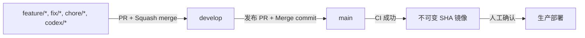
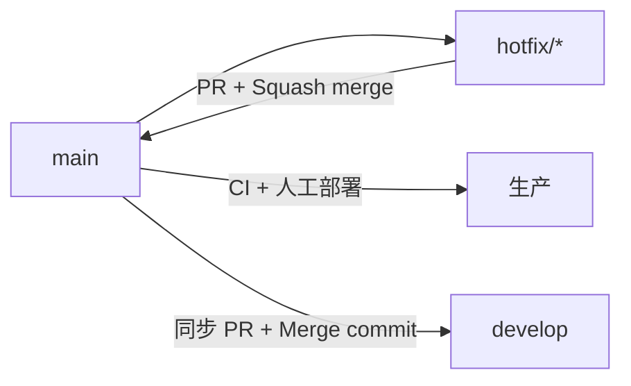

# MyWebDrive 轻量双分支 Git 工作流设计

- 状态：已批准，待实施
- 日期：2026-07-15
- 决策：采用 `main` 生产分支与 `develop` 开发集成分支
- 适用范围：GitHub 分支、Pull Request、CI、镜像发布、人工生产部署与热修复

## 1. 背景与当前状态

MyWebDrive 已经具备完整的 Core-first 质量门、不可变镜像发布合同和人工生产部署脚本，但 Git 分支仍以单一 `main` 为中心。2026-07-15 的现场检查确认：

- 远端存在 `main`，尚不存在 `develop`。
- `main` 没有 classic branch protection，仓库也没有 repository ruleset。
- `.github/workflows/ci.yml` 在所有 Pull Request 上运行，但 push 事件只监听 `main`。
- 只有成功 push 到 `main` 才会发布 `sha-<40 lowercase hex>` 不可变镜像。
- 生产部署不由 GitHub 自动执行；操作者使用 `infrastructure/alicloud/deploy.sh` 人工选择已发布的 SHA 镜像。
- GitHub 默认分支为 `main`，Dependabot 当前没有显式目标分支，因此默认向 `main` 创建更新 Pull Request。

现状可以证明每个进入 `main` 的提交，但不能把日常集成与生产权威分开，也不能阻止直接 push、force push 或未通过 CI 的合并。

## 2. 目标

本设计追求以下结果：

- `main` 始终表示已经通过发布门禁、可供人工部署的生产候选。
- `develop` 集成下一批准备发布的功能、修复和依赖更新。
- 日常修改不直接进入长期分支，而是通过短期分支和 Pull Request。
- 个人项目不要求第二位审核者，但任何合并仍必须通过 CI。
- `main` 合并后自动发布不可变镜像，生产部署继续保留人工确认。
- 紧急生产修复能够快速发布，并可靠同步回 `develop`。
- 规则由被 Git 跟踪的文档、CI 配置和 GitHub 分支保护共同表达。

## 3. 非目标

本轮不引入：

- 自动生产部署。
- 长期 `release/*` 分支或完整 Git Flow。
- 强制第二人审批或 CODEOWNERS 审批。
- 独立 staging 环境。
- 以可变标签、分支名或本地构建替代当前 SHA 镜像合同。
- 改变 Core-first 架构、Compose 权威或生产回滚机制。

## 4. 方案比较与决策

### 方案 A：继续使用单一 `main`

流程最短，但开发集成、发布候选和生产权威共享同一分支。每次合并都会发布镜像，也没有稳定位置容纳尚未准备发布的一组修改，因此不采用。

### 方案 B：轻量双分支

`develop` 负责日常集成，`main` 只接受发布和紧急修复。短期分支通过 Pull Request 合入 `develop`，发布时再通过 `develop -> main` Pull Request 提升。它保留明确生产边界，同时不引入长期 release 分支。

这是本设计选择的方案。

### 方案 C：完整 Git Flow

除 `main`、`develop` 外再维护长期或周期性的 `release/*` 分支。它适合多人并行维护多个版本，但个人项目会增加同步、冲突和规则维护成本，因此不采用。

## 5. 分支职责

### 5.1 长期分支

| 分支 | 责任 | 允许的来源 | 结果 |
| --- | --- | --- | --- |
| `main` | 生产权威与可部署版本 | `develop` 发布 PR、`hotfix/*` PR | CI 通过后发布不可变镜像 |
| `develop` | 下一版本的开发集成 | `feature/*`、`fix/*`、`chore/*`、`docs/*` PR，以及 `main` 热修复回流 PR | CI 验证，但不发布镜像 |

GitHub 默认分支继续保持 `main`，用于展示当前生产权威。创建普通 Pull Request 时必须显式选择 `develop` 为目标分支。

### 5.2 短期分支

- `feature/<slug>`：新功能。
- `fix/<slug>`：尚未进入生产的缺陷修复。
- `chore/<slug>`：依赖、构建、文档或维护工作。
- `docs/<slug>`：纯文档变更，可选；也可以使用 `chore/<slug>`。
- `hotfix/<slug>`：从 `main` 创建的紧急生产修复。
- `codex/<slug>`：Codex 创建的短期工作分支；语义上仍遵循上述目标分支规则。

短期分支在合并后删除。分支名使用小写 kebab-case，不在长期分支上直接开发。

## 6. 标准变更与发布流程



### 6.1 日常开发

1. 从最新 `develop` 创建短期分支。
2. 在短期分支完成聚焦的修改和测试。
3. 创建目标为 `develop` 的 Pull Request。
4. CI 必须成功，所有对话必须解决。
5. 使用 **Squash merge** 合入 `develop`，并删除短期分支。

Squash commit 使用带 scope 的 Conventional Commit，例如 `fix(storage): reduce health probe overhead`。这样 `develop` 对每个完成的工作项保留一条清晰提交。

### 6.2 发布

1. 确认 `develop` 当前 CI 成功且没有未完成的发布阻塞项。
2. 创建唯一的 `develop -> main` 发布 Pull Request，描述变更摘要、验证结果和剩余风险。
3. CI 必须在发布 Pull Request 上成功。
4. 使用 **Merge commit** 合入 `main`，不得 squash 整个 `develop`。
5. `main` push CI 再次验证合并结果，并只在成功后发布六个不可变 SHA 镜像。
6. 操作者确认发布结果后，在生产主机执行 `deploy.sh "sha-<main-full-sha>"`。
7. 部署脚本继续负责 migration、发布锁、镜像摘要、健康检查、版本校验和状态记录。

发布 PR 使用 Merge commit，是为了让 `develop` 的提交历史成为 `main` 的祖先，避免每次发布后两条长期分支因 squash 产生永久分叉。

## 7. 热修复流程



1. 从最新 `main` 创建 `hotfix/<slug>`。
2. 只包含解决生产问题所需的最小修改和回归测试。
3. 创建 `hotfix/* -> main` Pull Request；CI 成功后使用 Squash merge。
4. 等待 `main` CI 发布该提交对应的 SHA 镜像，再人工部署。
5. 部署后立即创建 `main -> develop` 同步 Pull Request，使用 Merge commit 合并。
6. 冲突必须在同步 Pull Request 中显式解决；不得仅靠口头记录或以后手工重做。

若热修复部署失败，使用现有 `rollback.sh` 选择历史不可变 manifest 回滚。回滚生产不回写 Git 历史，也不允许 force push `main`。

## 8. 分支保护设计

`main` 和 `develop` 应使用相同的基础保护：

- 必须通过 Pull Request 合并。
- 所需批准数为 `0`；仓库所有者可以合并自己的 Pull Request。
- 必须通过仓库现有 Core release CI job。
- Required status checks 使用 strict 模式，合并前分支必须基于最新目标分支。
- 必须解决所有 Pull Request 对话。
- 对管理员同样执行规则，防止个人项目因习惯性直接 push 绕过门禁。
- 禁止 force push。
- 禁止删除长期分支。

实施时必须从一次真实 CI run 查询 GitHub 报告的准确 status-check context，再写入保护规则；不能只根据 YAML job id 猜测名称。

本设计不限制谁可以创建分支，也不要求签名提交、线性历史或第二人审批。`main` 需要 Merge commit 来完成正常发布与热修复回流，因此不能启用“只允许线性历史”。

## 9. CI 与自动化设计

### 9.1 CI 触发

`.github/workflows/ci.yml` 的目标行为为：

```yaml
on:
  push:
    branches: [main, develop]
  pull_request:
    branches: [main, develop]
```

- Pull Request 到任一长期分支时运行完整质量和发布门禁。
- 合并到 `develop` 后再次验证实际集成提交，但不发布镜像。
- 合并到 `main` 后再次验证实际发布提交。
- 镜像发布条件继续严格限制为 `push` 到 `refs/heads/main`。
- Pull Request 或 `develop` push 永远不向 GHCR 发布生产候选镜像。

### 9.2 Dependabot

因为 GitHub 默认分支保持 `main`，`.github/dependabot.yml` 中所有 update source 必须显式设置：

```yaml
target-branch: develop
```

依赖更新因此走普通开发集成流程，不直接形成生产发布 PR。

### 9.3 Pull Request 提示

新增轻量 PR 模板，至少要求作者确认：

- 普通变更的目标分支是 `develop`。
- 目标为 `main` 时，该 PR 是发布提升或紧急修复。
- 已运行适用的质量、Smoke 或窄测试。
- 已描述剩余风险；生产部署仍需人工确认。

模板是防误操作提示，不替代 CI 或分支保护。

## 10. 文档权威

实施后由以下被 Git 跟踪的文件共同定义工作流：

- `docs/git-workflow.md`：完整日常流程、发布、热修复和恢复说明。
- `CONTRIBUTING.md`：贡献者必须遵守的分支、PR、合并与验证要求。
- `README.md`：简要入口，并链接到 `docs/git-workflow.md`。
- `.github/pull_request_template.md`：每次变更的操作提示。
- `.github/workflows/ci.yml`：可执行 CI 与镜像发布边界。
- `.github/dependabot.yml`：依赖更新目标分支。

本地 `AGENTS.md` 可以引用该规范，但它继续保持不被 Git 跟踪，不能作为团队唯一的 Git 工作流权威。

## 11. 初始迁移顺序

为避免在规则尚未就绪时锁死个人维护入口，实施按以下顺序执行：

1. 把本设计及后续实施计划通过当前短期分支提交并复核。
2. 从当时最新且绿色的 `main` 创建远端 `develop`。
3. 在基于 `develop` 的短期分支中修改 CI、Dependabot、PR 模板和跟踪文档。
4. 通过目标为 `develop` 的 Pull Request 合并这些变更。
5. 从 `develop` 创建首次发布 Pull Request 到 `main`，验证双分支发布路径。
6. 查询实际 CI check context，并为 `main`、`develop` 配置保护规则。
7. 验证保护规则确实拒绝直接 push、force push 和未通过检查的合并。

配置保护前必须保证仓库所有者仍能通过正常 Pull Request 合并自己的修改。若保护参数错误，应修改 GitHub 保护配置恢复正常 PR 路径，而不是 force push 或删除分支。

## 12. 验收标准

实施完成必须满足：

1. 远端同时存在 `main` 和 `develop`，默认分支仍为 `main`。
2. 两个长期分支均要求 Pull Request、required CI、最新目标分支和对话解决。
3. 两个长期分支均禁止 force push 和删除，且规则覆盖管理员。
4. 个人仓库所有者无需第二人批准即可在 CI 成功后合并自己的 Pull Request。
5. 普通功能和 Dependabot Pull Request 默认进入 `develop`。
6. `develop` push 运行 CI，但不会发布生产镜像。
7. `main` push 只有在完整 CI 成功后才发布不可变 SHA 镜像。
8. 没有自动生产部署；生产仍需显式运行权威部署脚本。
9. 热修复能够从 `main` 发布，并通过同步 Pull Request 回流 `develop`。
10. README、CONTRIBUTING、Git 工作流文档、PR 模板、CI 与 Dependabot 配置不存在相互矛盾的分支说明。

## 13. 风险与控制

- **CI 成本增加**：`develop` 合并后会再次执行完整门禁。该成本用于证明实际集成提交，暂不拆分轻量/重量工作流；若运行时间成为问题，再单独设计分层 CI。
- **误向 `main` 提交普通 PR**：通过 CONTRIBUTING、PR 模板和发布 PR 描述要求降低风险；个人维护者在合并前负责确认 PR 类型。
- **保护规则锁死个人仓库**：批准数固定为 0，并在启用管理员约束后立即验证自有 PR 合并路径。
- **热修复遗漏回流**：把 `main -> develop` 同步 PR 作为热修复完成条件，而不是可选清理动作。
- **分支长期漂移**：正常发布使用 Merge commit，不允许将整个 `develop` squash 到 `main`。

## 14. 后续实施边界

本设计获批后，实施计划应覆盖：

- 受测试保护的 CI 与文档修改。
- 创建远端 `develop`。
- 配置并验证 GitHub 分支保护。
- 验证一次普通开发合并路径与一次 `develop -> main` 发布路径。

实施计划不得自动部署生产，也不得删除现有远端历史分支；旧分支清理由独立盘点决定。
